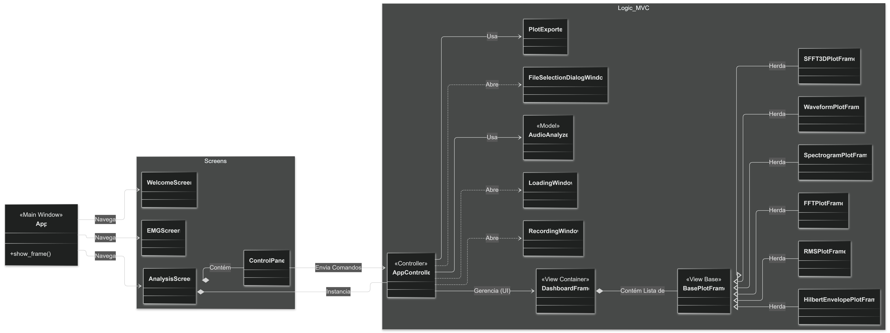
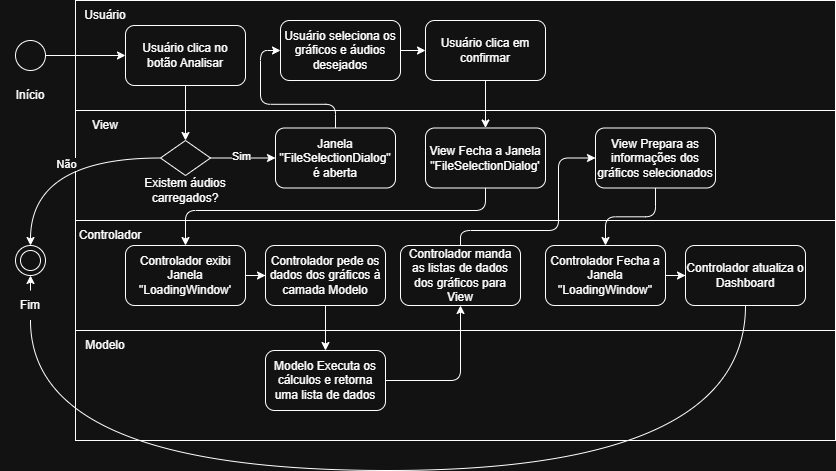

# Sound Analyzer Pro

Uma plataforma integrada para análise técnica de performance musical e biomecânica, combinando processamento digital de sinais (DSP) com monitoramento de eletromiografia (EMG).

## Índice

- [Visão Geral](#visão-geral)
- [Como Funciona - Explicação para Leigos](#como-funciona---explicação-para-leigos)
- [Arquitetura do Sistema](#arquitetura-do-sistema)
- [Estrutura de Diretórios](#estrutura-de-diretórios)
- [Instalação e Configuração](#instalação-e-configuração)
- [Funcionalidades e Fluxo de Uso](#funcionalidades-e-fluxo-de-uso)
- [Especificações Técnicas (DSP & Hardware)](#especificações-técnicas-dsp--hardware)
- [Equipe](#equipe)

---

## Visão Geral

O **Sound Analyzer Pro** é um software desktop desenvolvido para preencher a lacuna entre a percepção auditiva e a fisiologia da execução musical. O sistema permite que músicos e pesquisadores visualizem o som com precisão matemática enquanto monitoram, simultaneamente, a tensão muscular necessária para produzi-lo.

### Principais Funcionalidades

- **🎧 Análise de Áudio Avançada**: Decomposição sonora em múltiplos domínios (Tempo, Frequência, Tempo-Frequência).
- **💪 Monitoramento Biomecânico**: Leitura de sensores EMG via Bluetooth para análise de esforço e prevenção de lesões.
- **📊 Dashboard Interativo**: Visualização simultânea de Waveform, Espectrograma, FFT, Pitch e Envoltória.
- **🎛️ Controle Total**: Ferramentas de Zoom, Inspeção de Cursores e Seleção de Harmônicos.
- **💾 Relatórios**: Exportação de gráficos em alta resolução para fins acadêmicos e documentais.

### Stack Tecnológico

| Componente | Tecnologia |
|------------|------------|
| Linguagem | Python 3.10+ |
| Interface Gráfica | CustomTkinter (CTk) |
| Processamento (DSP) | NumPy, SciPy |
| Plotagem | Matplotlib |
| Áudio I/O | wavfile/sounddevice |
| Conectividade Hardware | PySerial (Bluetooth) |

---

## Como Funciona - Explicação para Leigos

Esta seção explica a estratégia do projeto de forma acessível, usando analogias e linguagem simples.

### O Problema

Um instrumento tem diferentes formas de ser manuseado, emitindo diferentes formatos de som e exigindo diferentes movimentos musculares. Para um músico de alta performance, "tocar bem" não é apenas acertar as notas. Envolve a qualidade do timbre, a economia de movimentos para evitar lesões (como tendinites) e entender quais técnicas devem ser usadas em determinado momento. Porém, é difícil perceber micro-tensões musculares ou pequenas variações de afinação apenas ouvindo ou sentindo.

### A Solução

O Sound Analyzer Pro funciona como um microscópio para o som e um raio-x para os músculos. Ele traduz fenômenos invisíveis (ondas sonoras e impulsos elétricos) em gráficos visuais que o músico consegue entender.

### Os 3 Pilares da Estratégia

```
┌─────────────────────────────────────────────────────────────────────────┐
│                       ESTRATÉGIA SOUND ANALYZER                         │
├─────────────────┬─────────────────────┬─────────────────────────────────┤
│    1. CAPTAR    │    2. PROCESSAR     │          3. VISUALIZAR          │
│    (Sensores)   │    (Matemática)     │              (UI)               │
├─────────────────┼─────────────────────┼─────────────────────────────────┤
│ Microfone (Som) │ Transformada Fourier│ Gráficos de Onda (Tempo)        │
│ Sensor EMG      │ Transformada Hilbert│ Mapas de Calor (Espectrograma)  │
│ (Músculo)       │ Cálculos RMS        │ Métricas de Tensão              │
└─────────────────┴─────────────────────┴─────────────────────────────────┘
```

#### Pilar 1: Captação (Os "Ouvidos" e "Tato" do Sistema)

O sistema escuta o instrumento através do microfone e "sente" o músculo através de eletrodos colados na pele (EMG).

#### Pilar 2: Processamento (O Cérebro Matemático)

Aqui entra o Model (AudioAnalyzer). Ele pega o som bruto e aplica fórmulas matemáticas complexas para separar o som em "fatias":
- Qual a nota exata? (Pitch)
- Quão "brilhante" é o som? (FFT)
- Quanta energia tem? (RMS)

#### Pilar 3: Visualização (A Interface)

O Controller organiza esses dados e a View os desenha na tela. É como o painel de um avião, mostrando altitude e velocidade em tempo real para que o piloto (músico) possa corrigir a rota.

---

### Arquitetura do Sistema

O sistema segue estritamente o padrão MVC (Model-View-Controller) para garantir desacoplamento e facilidade de manutenção.

#### Diagrama de Classes

<p align="center">
  
</p>

#### Fluxo de Análise de Áudio
O diagrama abaixo detalha o ciclo de vida de uma solicitação de análise, desde o clique do usuário até a renderização na tela.

<p align="center">
  
</p>

---

### Estrutura de Diretórios

## Estrutura de Diretórios

```text
SoundAnalyzerPro/
├── app/                        # Código fonte principal
│   ├── controller/             # Lógica de Orquestração
│   │   ├── __init__.py
│   │   └── app_controller.py
│   ├── model/                  # Lógica de Negócios e Matemática
│   │   ├── __init__.py
│   │   └── audio_analyzer.py
│   ├── view/                   # Interface Gráfica
│   │   ├── components/         # Widgets reutilizáveis (Plots, Painéis)
│   │   ├── images/             # Imagens utilizadas na UI
│   │   ├── screens/            # Telas Principais (Analysis, EMG)
│   │   ├── services/           # Utilitários de View (ex: Exportadores)
│   │   └── windows/            # Janelas Auxiliares (Dialogs)
│   └── main.py                 # Ponto de entrada
│
├── audios/                     # Arquivos de exemplo
├── docs/                       # Documentação técnica e UML
├── requirements.txt            # Dependências do projeto
└── README.md                   # Este arquivo
```

---

### Instalação e Configuração

#### Requisitos do Sistema
- 3.10 ou superior.
- Hardware (Opcional): Dispositivo EMG compatível com comunicação Serial/Bluetooth.
- Bibliotecas: numpy, scipy, matplotlib, customtkinter, pyserial.

```bash
# 1. Clonar o repositório
git clone https://github.com/seu-usuario/SoundAnalyzerPro.git
cd SoundAnalyzerPro

# 2. Criar ambiente virtual (Recomendado)
python -m venv .venv

# Ativar no Windows:
.venv\Scripts\activate

# Ativar no Linux/Mac:
source .venv/bin/activate

# 3. Instalar dependências
pip install -r requirements.txt

# 4. Executar a aplicação
python app/main.py
```

---

## Funcionalidades e Fluxo de Uso

O sistema foi desenhado para atender o fluxo de trabalho natural de um músico ou pesquisador acadêmico.

### Fluxo Principal

1. **Carregar/Gravar:** O usuário inicia importando um arquivo de áudio (`.wav`) existente ou gravando uma performance em tempo real diretamente no app.
2. **Configurar Análise:** Através de um painel de controle, seleciona-se quais métricas são relevantes para o estudo (ex: apenas *Pitch* e *Espectrograma*).
3. **Processamento:** O sistema calcula as transformadas necessárias e exibe o Dashboard.
4. **Interação e Estudo:**
    * **Zoom:** Permite focar em transientes (ataques) específicos da nota.
    * **Cursores:** Inspeção precisa de frequência (Hz) e amplitude (dB).
    * **Grid:** Auxílio visual para comparação de tempos.
5. **Exportação:** Ao final do estudo, os gráficos podem ser salvos como imagens de alta resolução para inclusão em teses ou artigos.

---

### Licença

Este software é de uso interno.

---

### Suporte

Para dúvidas ou problemas, entre em contato com a equipe de desenvolvimento.